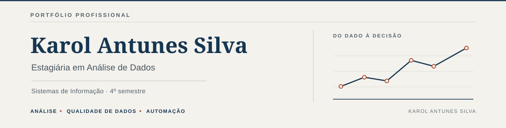

  

Neste perfil, reúno projetos de análise, tratamento e automação de dados, além das práticas que venho desenvolvendo.

[LinkedIn](https://www.linkedin.com/in/karol-antunes-silva-2b9236390/) | [Explorar repositórios](https://github.com/karol123-CMD?tab=repositories)

## Formação em andamento

Estou cursando o **Certificado Profissional de Análise de Dados do Google (Google Data Analytics)**. A formação está em andamento.

## Ferramentas

**Aplicadas nos projetos publicados**

  
  
  
  
  
  
  
  

SQL, Excel e Power Query sustentam os projetos de análise e tratamento de dados. Google Sheets e Supabase aparecem no TaskFlow; n8n e Node.js, no fluxo de automação do AI Commerce Readiness. Git é utilizado no versionamento.

**Em estudo e aprofundamento:** Python, Power BI, pipelines de dados, Analytics Engineering e Data Engineering.

## Skills em prática

- **Dados:** SQL, modelagem relacional, ETL, Power Query e qualidade de dados.
- **Análise:** EDA, segmentação, indicadores e comunicação de resultados.
- **Automação:** n8n, Node.js e integração de serviços.

## Projetos em destaque

| Projeto | Foco | Tecnologias |
| --- | --- | --- |
| [Credit Risk Analytics](https://github.com/karol123-CMD/credit-risk-etl-pipeline) | Tratamento de dados e análise exploratória de risco de crédito. | Excel, Power Query |
| [TaskFlow Analytics](https://github.com/karol123-CMD/TaskFlow-analytics-gestao-tarefas) | Organização de tarefas e análise de SLA e produtividade. | SQL, Google Sheets, Supabase |
| [Distribuidora Alpha](https://github.com/karol123-CMD/projeto-sql-distribuidora-alpha) | Modelagem relacional e consultas de vendas em uma base fictícia. | SQL, SQLite |
| [AI Commerce Readiness](https://github.com/karol123-CMD/ai-commerce-readiness-mvp) | Análise de qualidade de anúncios e integração de um fluxo automatizado. | n8n, Node.js, JavaScript |

## Próximos passos de aprendizagem

Concluir a formação do Google, aprofundar Python e Power BI e evoluir na construção de processos de dados reproduzíveis. Meu foco atual é consolidar a atuação em Data Analytics enquanto desenvolvo fundamentos para Analytics Engineering e Data Engineering.
